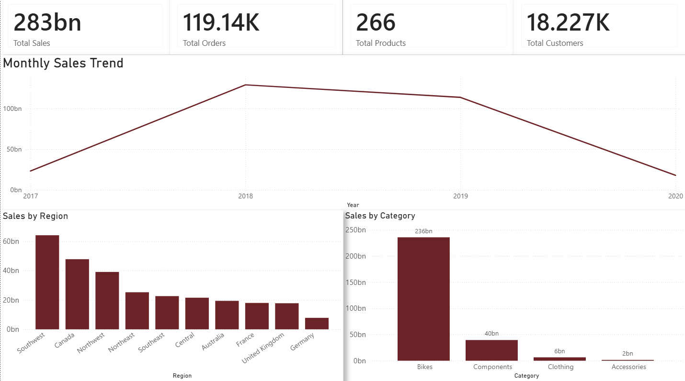
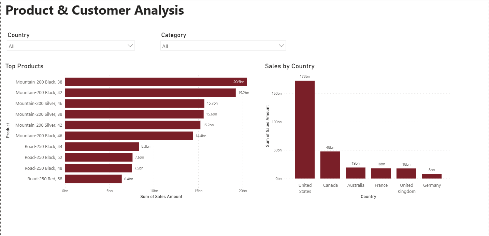
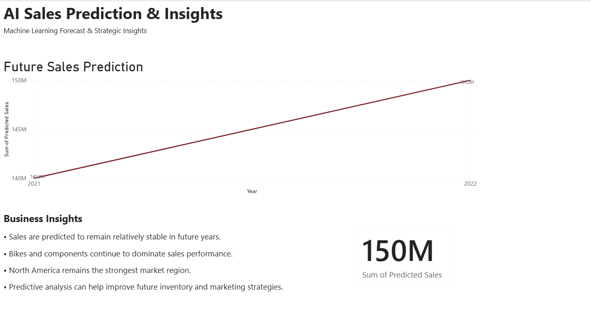

# AdventureWorks Sales Analysis & AI Prediction Dashboard

## Project Overview
This project analyzes sales performance, customer purchasing behavior, and future sales prediction using the AdventureWorks Sales dataset. The project combines data preprocessing, exploratory data analysis (EDA), machine learning, and interactive dashboard visualization using Power BI.

The main goal of this project is to discover sales trends, identify high-performing products and regions, and provide business insights from a CRM (Customer Relationship Management) perspective.

---

## Tools Used
- Python
- Pandas
- Matplotlib
- Scikit-learn
- Google Colab
- Power BI

---

## Project Workflow

### 1. Data Preprocessing
The raw dataset was cleaned and prepared before analysis by:
- removing missing values
- removing duplicate data
- converting data types
- preparing a clean dataset for visualization and prediction

---

### 2. Exploratory Data Analysis (EDA)
Several analyses were conducted to understand sales and customer behavior, including:
- monthly sales trends
- sales by category
- sales by region
- sales by country
- top-selling products

The analysis helped identify important business patterns and customer purchasing behavior.

---

### 3. Power BI Dashboard
An interactive Power BI dashboard was created to visualize business performance and sales insights.

The dashboard consists of 3 pages:

#### Page 1 — Executive Dashboard
Displays overall business performance:
- Total Sales
- Total Orders
- Total Products
- Total Customers
- Monthly Sales Trend
- Sales by Region
- Sales by Category

---

#### Page 2 — Product & Customer Analysis
Focused on product and regional analysis using interactive filters:
- Country filter
- Category filter
- Top-selling products
- Sales by country

---

#### Page 3 — AI Prediction & Insights
Displays future sales prediction and business recommendations:
- Future sales prediction
- Predicted sales KPI
- Business insights and recommendations

---

## Machine Learning Prediction
A simple prediction model was implemented to estimate future sales performance and visualize predicted sales trends.

The prediction results were integrated into the Power BI dashboard to support business decision-making and CRM analysis.

---

## Project Outcome
This project demonstrates how business intelligence tools and machine learning can be combined to analyze customer behavior, visualize sales performance, and support data-driven business decisions through interactive dashboards and predictive analysis.

---

## Academic Project
This project was developed as a final term project for the Application Programming course, focusing on business intelligence, sales analysis, CRM insights, and AI-based prediction using Python and Power BI.
